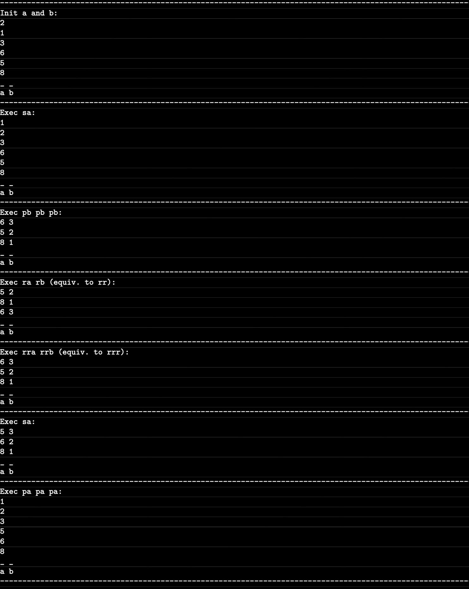

<h1 align="center">Push Swap</h1>

#### For this project we will have to sort data in a stack with limited instructions in the minimum possible movements. To do this we will have to use some sorting algorithm.

## 📚 Mandatory Part 📚

- **Name of the program** : `push_swap`
- **Files** : [`*.c`](./src) [`fdf.h`](./include) [`Makefile`](./Makefile)
- **Makefile rules** : `all` `clean` `fclean` `re`
- **Authorized functions** : [`read`](https://man7.org/linux/man-pages/man2/read.2.html) [`write`](https://man7.org/linux/man-pages/man2/write.2.html) [`malloc`](https://man7.org/linux/man-pages/man3/free.3.html) [`free`](https://man7.org/linux/man-pages/man3/free.3.html) [`exit`](https://www.tutorialspoint.com/c_standard_library/c_function_exit.htm)
- [**Libft**](https://github.com/Zsolt42/Libft) **authorized**.

## 📏 Rules 📏

#### To get started:

- In stack a you will have positive and negative numbers, never duplicated.
- In stack b you will have nothing.

#### The objective is to sort the numbers from stack a from smallest to largest. To do this you have some operations:

- sa: Swap the first two numbers froma stack a. Does nothing if there are no enough numbers.
- sb: Swap the first two numbers froma stack b. Does nothing if there are no enough numbers.
- ss: Does sa and sb.
- pa: Puts the first number from stack b to the top of stack a.
- pb: Puts the first number from stack a to the top of stack b.
- ra: Move all the numbers of the stack a 1 position up, do the first number goes to the bottom of the stack.
- rb: Move all the numbers of the stack b 1 position up, do the first number goes to the bottom of the stack.
- rr: Does ra and rb.
- rra: Move all the numbers of the stack a 1 position down, do the last number goes to the top of the stack.
- rrb: Move all the numbers of the stack b 1 position down, do the last number goes to the top of the stack.
- rrr: Does rra and rrb.

### 💣 Examples 💣

  

